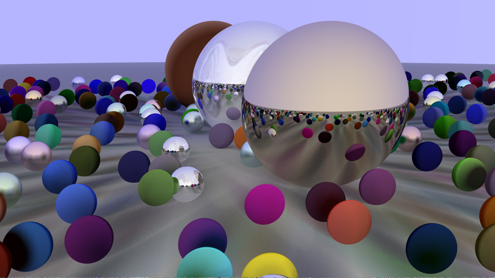

# Ray Tracer

## Description
The following project is an implementation of a raytracer engine in cpp. The code of the project is mainly inspired by 
the excellent [raytracing in a weekend](https://raytracing.github.io/books/RayTracingInOneWeekend.html) book. In this book
some of the basic concepts behind modern graphical rendering are written in the cpp language. Although a main flaw of the
code is that it is not realtime and runs on the cpu.

## How to use
For using this project you will need to add the object's you want to be rendered to the scene. At the current version only
spheres can be rendered by the engine, So you will have to add some sphere's to the world and after that, you will need to
add a material to each of these spheres. Currently, 4 classes of materials are available.

 - matte (lambertian)
 - metal
 - dielectric
 - diffuse light

After that you will have to choose a location for the camera to cast the rays at the target and start rendering the scene.

The code bellow is an example code for adding a sphere to the `<0,-1000,0>` location with a radius of 1000 and material
of type `ground_material`.
```c++
world.add(make_shared<sphere>(point3(0,-1000,0), 1000, ground_material));
```
This code is for creating the `ground_material` used by the sphere in the code above. As you can see the material is of 
lambertian type and has an albedo color of `<0.5,0.5,0.5>`.
```c++
auto ground_material = make_shared<lambertian>(color(0.5, 0.5, 0.5));
```
And at last for rendering the scene the code bellow is used to do basic setup for the camera.
```c++
camera c;
c.vfov     = 20;
c.lookfrom = point3(13,2,3);
c.lookat   = point3(0,0,0);
c.vup      = vec3(0,1,0);
c.render(world);
```
It should be mentioned that all the above codes need to be added to the `main.cpp` file.

## Features
The current version of the engine supports bvh for improving the render time of scenes. The first example seen in the b
Examples section is rendered without the bvh optimizations and took nearly 18 hours to render, while the second image, 
with the same amount of objects and more complex calculations for the lighting took only 40 minutes to render.
Support for emmisive materials and simples lights has been added to. Although in the current version there are not textures
for the light or the objects.
## Examples
Examples of different stages of the ray tracer are available in the images folder of this project. A final high resolution
render of the engine is present below.




## Further work
Adding more advanced techniques to the ray tracer and more classes of objects and materials. And including actual lights
for more realistic rendering.
Also, the render times for high quality scenes is very long and that is because the program is running in a single core.
Adding threads and multiprocessing to this code can improve its performance time significantly.